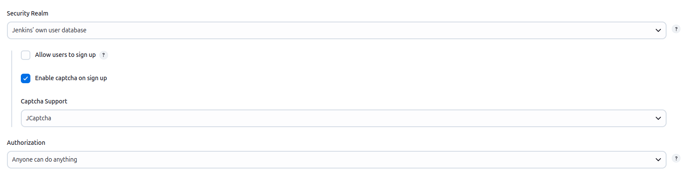

# JCaptcha Plugin

JCaptcha provider of Jenkins' CaptchaSupport extension point.

## Changelog

See GitHub releases

## Previous Changelog

### 1.1 (released 2011-07-22)

- fix a dependency on a -SNAPSHOT Jenkins' core version

### 1.0 (released 2011-06-08)

- initial implementation
